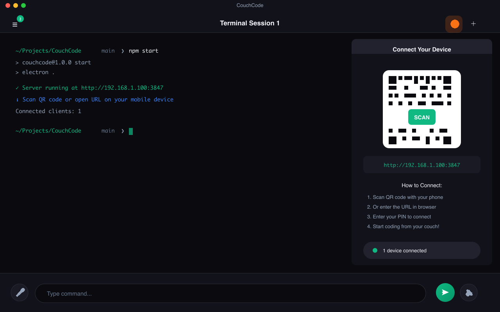
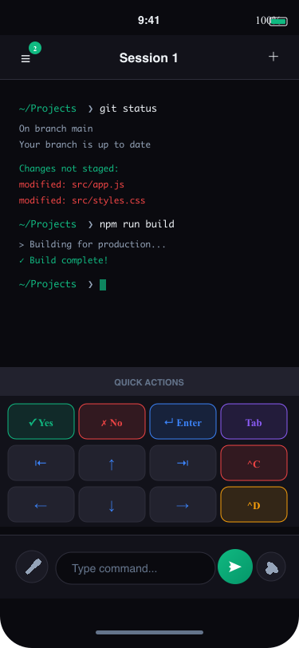
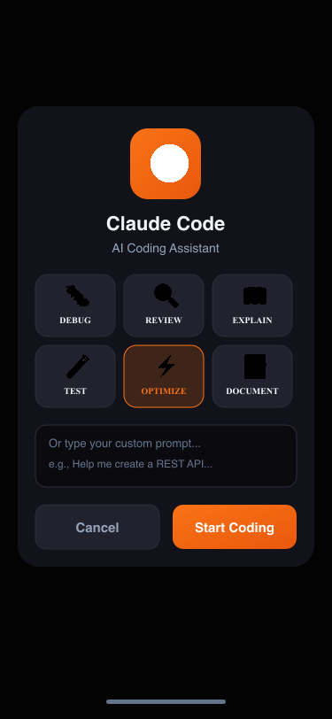
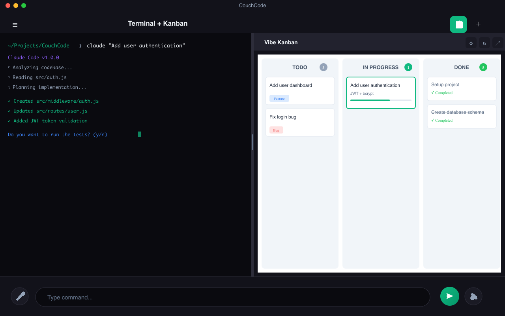

<div align="center">

# 🛋️ CouchCode

### Code From Your Couch - Control Your Terminal From Anywhere

[](https://opensource.org/licenses/MIT)
[](#installation)
[](https://www.electronjs.org/)
[](https://github.com/AhmedKaram2/CouchCode/pulls)

<p align="center">
  <strong>Access your computer's terminal remotely from any device with a web browser.</strong>
</p>

<p align="center">
  <em>Because the best code is written from the comfort of your couch.</em> 🛋️
</p>

[Features](#-features) • [Installation](#-installation) • [Usage](#-usage) • [Screenshots](#-screenshots) • [Contributing](#-contributing)

---

</div>

## 🎯 Why CouchCode?

Ever wanted to run a quick terminal command but your laptop is across the room? Or check on a long-running process without getting up? **CouchCode** lets you control your computer's terminal from your phone, tablet, or any device with a browser.

Perfect for:
- 🏠 **Remote developers** - Access your dev machine from anywhere in your home
- 📱 **Mobile monitoring** - Check build status, logs, or server health from your phone
- 🤖 **AI pair programming** - Use with Claude Code, Copilot, or other AI coding assistants
- 💻 **Multi-device workflows** - Seamlessly switch between devices

## ✨ Features

### 🌐 Remote Access
- **Browser-Based** - No app installation needed on client devices
- **PWA Support** - Install as a native-like app on your phone
- **Real-time Sync** - Instant command execution via WebSocket
- **Session Persistence** - Terminal history syncs when you reconnect

### 🔒 Security First
- **PIN Authentication** - Secure access with JWT tokens
- **Local Network** - Runs on your network, your data stays local
- **No Cloud Required** - Direct connection, no third-party servers

### 📱 Mobile Optimized
- **Calculator Keyboard** - Quick action buttons for common commands
- **Voice Input** - Speak commands using speech recognition
- **Text-to-Speech** - Hear results read aloud
- **Smart Prompts** - Auto-detect yes/no prompts with quick buttons

### 🖥️ Multi-Platform
- **Windows** - PowerShell, CMD, Git Bash, WSL
- **macOS** - Zsh, Bash, Fish
- **Linux** - All major shells supported

### 🤖 AI Integration
- **Vibe-Kanban** - Split view with task management board
- **Vibe-Claude** - Quick command buttons for AI coding agents
- **Claude Code Ready** - Perfect companion for AI pair programming

## 📦 Installation

### Download Installer

| Platform | Download | Size |
|----------|----------|------|
| **macOS (Apple Silicon)** | [CouchCode-1.2.0-mac-arm64.dmg](https://github.com/AhmedKaram2/CouchCode/releases/download/v1.2.0/CouchCode-1.2.0-mac-arm64.dmg) | 92 MB |
| **macOS (Intel)** | [CouchCode-1.2.0-mac-x64.dmg](https://github.com/AhmedKaram2/CouchCode/releases/download/v1.2.0/CouchCode-1.2.0-mac-x64.dmg) | 97 MB |
| **Windows (64-bit)** | [CouchCode-1.2.0-win-x64.exe](https://github.com/AhmedKaram2/CouchCode/releases/download/v1.2.0/CouchCode-1.2.0-win-x64.exe) | 77 MB |
| **Linux (Universal)** | [CouchCode-1.2.0-linux-x86_64.AppImage](https://github.com/AhmedKaram2/CouchCode/releases/download/v1.2.0/CouchCode-1.2.0-linux-x86_64.AppImage) | 107 MB |
| **Linux (Debian/Ubuntu)** | [CouchCode-1.2.0-linux-amd64.deb](https://github.com/AhmedKaram2/CouchCode/releases/download/v1.2.0/CouchCode-1.2.0-linux-amd64.deb) | 74 MB |

> **[View all releases](https://github.com/AhmedKaram2/CouchCode/releases)**

### macOS Installation Note

Since the app is not code-signed, macOS may show a warning. To fix this:

**If you see "app is damaged and can't be opened":**
```bash
# Open Terminal and run:
xattr -cr /Applications/CouchCode.app
```

**If you see "unidentified developer":**
1. Open **System Preferences** → **Security & Privacy**
2. Click **Open Anyway** next to the CouchCode message

> **Important:** Choose the correct version for your Mac:
> - **Apple Silicon** (M1/M2/M3): Use the `arm64` version
> - **Intel Mac**: Use the `x64` version
>
> Using the wrong version will cause session creation to fail.

### Build From Source

```bash
# Clone the repository
git clone https://github.com/AhmedKaram2/CouchCode.git
cd CouchCode

# Install dependencies
npm install

# Run in development mode
npm start

# Build installer for your platform
npm run installer
```

## 🚀 Quick Start

### 1️⃣ Start CouchCode

Launch the app on your computer. It starts a server on your local network.

### 2️⃣ Connect from Your Phone

**Scan QR Code** (easiest):
- Click the QR icon in the app
- Scan with your phone camera
- Opens automatically in browser

**Or enter URL manually**:
- Note the URL shown (e.g., `http://192.168.1.100:3847`)
- Open in any browser on your network

### 3️⃣ Set Your PIN

First time: Create a PIN (4-8 characters)
Next time: Enter your PIN to connect

### 4️⃣ Start Coding! 🎉

Create a terminal session and run commands from your couch!

## 📱 Install as Mobile App

For the best experience, add to your home screen:

**iPhone/iPad (Safari):**
1. Open CouchCode URL in Safari
2. Tap Share → "Add to Home Screen"

**Android (Chrome):**
1. Open CouchCode URL in Chrome  
2. Tap Menu → "Add to Home screen"

## 🎹 Quick Actions

The mobile keyboard includes these shortcuts:

| Button | Action | Description |
|--------|--------|-------------|
| ✓ Yes | `y` + Enter | Confirm prompts |
| ✗ No | `n` + Enter | Decline prompts |
| ↵ | Enter | Execute command |
| ^C | Ctrl+C | Cancel/Interrupt |
| ^D | Ctrl+D | EOF/Exit |
| ^Z | Ctrl+Z | Suspend process |
| Tab | Tab | Auto-complete |
| ⌫ | Backspace | Delete character |
| ↑↓←→ | Arrows | Navigate history/cursor |

## 🛠️ Tech Stack

| Component | Technology |
|-----------|------------|
| Desktop App | Electron 28 |
| Terminal | node-pty + xterm.js |
| Server | Express + WebSocket |
| Frontend | Vanilla JS + PWA |
| Auth | JWT + bcrypt |

## 📁 Project Structure

```
CouchCode/
├── src/
│   ├── main/           # Electron main process
│   │   ├── main.js     # App entry point
│   │   ├── server.js   # Express + WebSocket server
│   │   ├── pty-manager.js  # Terminal session management
│   │   └── tray.js     # System tray integration
│   ├── renderer/       # Desktop UI
│   └── client/         # PWA web interface
│       ├── app.js      # Main application logic
│       ├── terminal.js # xterm.js wrapper
│       └── styles.css  # Mobile-first responsive styles
├── build/              # App icons and assets
├── scripts/            # Build automation
└── dist/               # Generated installers
```

## 📸 Screenshots

<div align="center">

### Desktop App

<p><em>Main desktop window with QR code for easy mobile connection</em></p>

### Mobile Terminal
<table>
  <tr>
    <td align="center">
      
      <p><em>Full terminal access from your phone</em></p>
    </td>
    <td align="center">
      
      <p><em>Calculator-style quick action keyboard</em></p>
    </td>
  </tr>
</table>

### Claude Code Integration

<p><em>Quick access to AI coding assistant</em></p>

### Split View with Kanban

<p><em>Terminal + Vibe-Kanban side by side</em></p>

</div>

> **Note:** To add your own screenshots, save images to the `screenshots/` folder and they'll appear here.

## 📄 License

This project is licensed under the MIT License - see the [LICENSE](LICENSE) file for details.

## 🙏 Acknowledgments

- [Electron](https://www.electronjs.org/) - Cross-platform desktop apps
- [xterm.js](https://xtermjs.org/) - Terminal emulator for the web
- [node-pty](https://github.com/microsoft/node-pty) - Native terminal bindings

---

<div align="center">

**[⬆ Back to Top](#-couchcode)**

Made with ❤️ and ☕ from the couch

<sub>Star ⭐ this repo if you find it useful!</sub>

</div>
